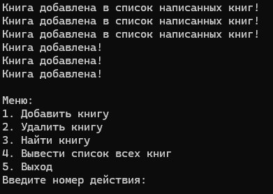
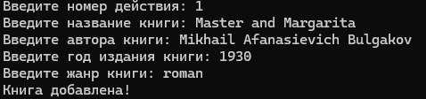
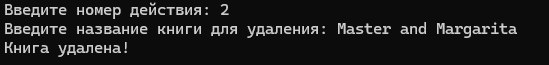
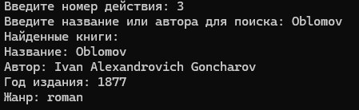
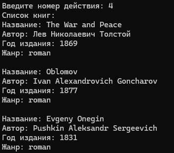
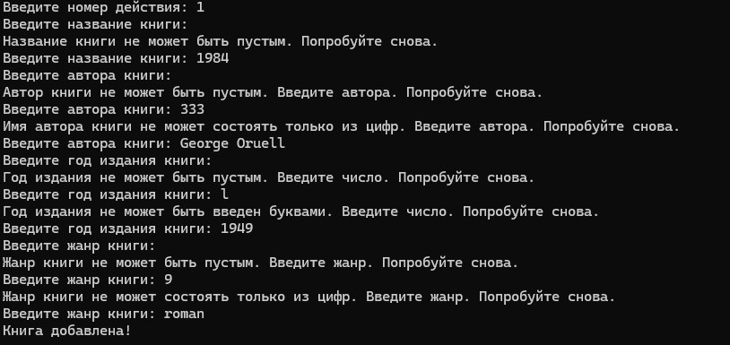
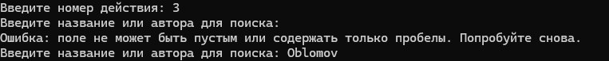

# Проект "Управление библиотекой"
## Задание 1
Необходимо создать многофайловый проект на C++, который позволит управлять библиотекой книг. 

### Проект должен состоять из нескольких файлов:
1.	main.cpp - основной файл, в котором находится функция main().
2.	book.h - заголовочный файл, содержащий структуру bookи объявления функций и переменных для работы с книгами.
3.	book.cpp - файл, содержащий реализацию функций для работы с книгами.
4.	library.h - заголовочный файл, содержащий структуру library и объявления функций и переменных для работы с библиотекой.
5.	library.cpp - файл, содержащий реализацию функций для работы с библиотекой.
6.	Writer.h – заголовочный файл, содержащий структуру писатель и все его функции.
7.	Writer.cpp– файл реализации всех функций писателя

## Требования
### В структуре писатель должны находится следующие атрибуты:
1.	День рождения в формате “DD:MM:YYYY”
2.	ФИОв качестве одной переменной (p.s. это значит, для ФИО необходимо выделить отдельную структуру)
3.	Список написанных автором книг. Контейнер для хранения выбирается по вашему усмотрению (vector, map, массив, список…). При сдаче объяснить выбор того или иного контейнера.
4.	Возраст писателя.

### В структуре писатель должны быть реализованы следующие функции:
1.	Изменить имя
2.	Изменить фамилию
3.	“Написать” книгу. А точнее просто создать экземпляр структуры bookи добавить его в список написанных автором книг.

### В библиотеке хранятся книги, каждая из которых имеет следующие атрибуты:
1.	Название
2.	Автор
3.	Год издания
4.	Жанр (роман, повесть, стихи и т.д.)

### В библиотеке можно выполнять следующие действия:
1.	Добавить книгу
2.	Удалить книгу
3.	Найти книгу по названию или автору
4.	Вывести список всех книг
В файле main.cpp должна быть реализована функция main(), которая позволяет пользователю взаимодействовать с библиотекой.

### Условия
1.	Не использовать классы
2.	Использовать только функции, переменные и структуры
3.	Использовать файлы book.h, book.cpp, library.h, library.cpp, writer.h, writer.cpp и main.cpp
4.	Обеспечить корректную работу программы и обработку ошибок

# Задание 2
1.	Собрать проект в vscodeпри помощи  g++, а затем запустить объектный файл.
2.	Написать Cmakelists.txt
3.	Произвести сборку и запуск проекта при помощи cmake
4.	Сделать отчет на github. Создатьотдельнуюветкуиназватьее“first refactoring of library project: no classes”. В отчете должны быть все перечисленные выше файлы, включая Cmakelists.txt, а также readmeи файл конфигурации gitignore. Лишних файлов не должно быть.
5.	Оформить readme. В качестве примера оформленияможете ознакомиться: https://github.com/Gogosan1/Compiler

# Реализация
### Меню

### Добавление книги

### Удаление книги

### Поиск

### Вывод книг

## Работа с пограничными случаями

## При добавлении книги:
Для пункта "добавить книгу" существуют такие пограничные случаи, как:
1.	Название книги не может содержать в себе пустую строку;
2.	Строка с вводом автораа книги не может содержать в себе пустую строку ;
3.	Имя автора не может содержать в себе цифры;
4.	Год издания не может быть пустой строкой;
5.	Год издания нельзя записать буквами.
6.	Жанр не может быть пустой строкой.
7.	Жанр не может быть хаписан цифрами.
   
Как код регирует на эти случаи представлено ниже:
   

## При удалении книги
Если введена пустая строка, программа выдает сообщение о том, что книга не найдена. Сообщение так же будет выводиться и в случае если введеной книги действительно нет в спике добавленных:

## При поиске книги
В случае если будет введена пустая строка программа будет выдавать сообщение об ошибке:

# Заключение
В ходе выполнения данной работы был создан многофайловый проект на языке C++, который продемонстрировал основы управления библиотекой книг. Проект успешно реализует функциональность по добавлению, удалению, поиску и выводу списка книг, а также управлению писателями и их произведениями. Проект состоит из нескольких файлов, каждый из которых выполняет свою поставленную задачу: от определения структур данных до реализации функций работы с ними. 

Для хранения списка книг и произведений мы решили использовать структуру данных vector, поскольку она имеет динамическое расширение: то есть при добавлении новых книг vector автоматически расширяется что упрощает управление списком, а так же данная структура предоставляет удобный итератор для прохода по всем книгам в списке, что полезно при выводе информации о книгах.

Данный проект помог нам прокачать навык работы с многофайловыми проектами на языке С++, что в дальнейшем будет полезно при разработке крупных приложений.

